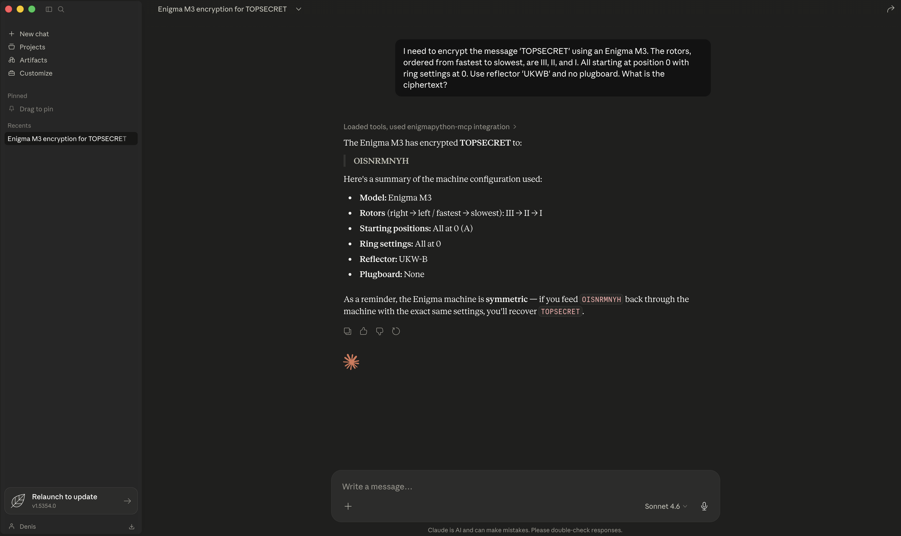

# Enigma Python MCP Server

An MCP (Model Context Protocol) server that brings the capabilities of the [enigmapython](https://github.com/denismaggior8/enigma-python) library to LLMs, allowing them to encrypt and decrypt messages using historically accurate Enigma machine emulators.



[](https://pypi.org/project/enigmapython-mcp/)
[](https://www.python.org/downloads/)
[](https://pypi.org/project/enigmapython-mcp/)
[](https://opensource.org/licenses/MIT)
[](https://github.com/denismaggior8/enigma-python-mcp/actions/workflows/publish.yml)

## Features
- **Exposes all known Enigma machine models**: Enigma M3, Enigma M4, Enigma I, Enigma K, Enigma Z, Enigma D, and more.
- **Dynamic Configuration**: LLMs can specify rotors, initial positions, ring settings, reflectors, and plugboard pairs for the encryption.
- **Local and Network Mode**: Supports both `stdio` transport for local MCP integrations (like Claude Desktop) and `sse` transport to expose the tools over a network.
- **Dockerized**: Easy portability and execution across platforms.

## Exposed Tools

### `encrypt_message`
Encrypt or decrypt a message using a configured Enigma machine.

**Arguments:**
- `machine_model` (str): Model name. Supported: `'M3'`, `'M4'`, `'I'`, `'I_Norway'`, `'I_Sondermaschine'`, `'K'`, `'K_Swiss'`, `'D'`, `'Z'`, `'B_A133'`.
- `message` (str): The plaintext or ciphertext to process.
- `rotors` (list[object]): List of `RotorConfig` objects. Each object specifies `rotor_type` (str), `ring_setting` (int, default=0), and `initial_position` (int | str, default=0). IMPORTANT: The list MUST be ordered exactly as: `[Fastest/Rightmost, Middle, Slowest/Leftmost, Greek (if M4)]`.
- `reflector` (object): A `ReflectorConfig` object specifying `reflector_type` (str), and optionally `ring_setting` (int) and `initial_position` (int | str) for rotating reflectors.
- `plugboard_pairs` (dict, optional): Dictionary mapping plugboard connections (e.g., `{"A": "B", "C": "D"}`).

## Running the Server

### Using Python
Requires Python 3.11+.

1. Install the package from PyPI:
   ```bash
   pip install enigmapython-mcp
   ```
   *(Alternatively, you can just run `uvx enigmapython-mcp` if you have `uv` installed!)*

2. Run via stdio (for local MCP client):
   ```bash
   enigmapython-mcp --transport stdio
   ```

3. Run via SSE (exposing over network):
   ```bash
   enigmapython-mcp --transport sse --host 0.0.0.0 --port 8000
   ```

### Using Docker
1. Build the container:
   ```bash
   docker build -t enigmapython-mcp .
   ```

2. Run via stdio (default):
   ```bash
   docker run -i enigmapython-mcp
   ```

3. Run via SSE:
   ```bash
   docker run -p 8000:8000 enigmapython-mcp --transport sse --host 0.0.0.0 --port 8000
   ```

## Client Configuration (Claude Desktop)
We provide two distinct `mcpb` bundles for 1-click installation on Claude Desktop. Simply download your preferred bundle from the GitHub Releases page and drag-and-drop it into Claude Desktop's Extensions menu:

1. **`enigmapython-mcp-docker.mcpb`**: Extremely lightweight, relies on your local Docker daemon to run the server in an isolated container. *(Recommended)*
2. **`enigmapython-mcp-python.mcpb`**: Contains the full Python source. Claude Desktop will natively build a virtual environment and run the server without needing Docker.

If you prefer manual configuration via `claude_desktop_config.json`, use the settings below:

### Using Python (uvx recommended)
```json
{
  "mcpServers": {
    "enigma": {
      "command": "uvx",
      "args": ["enigmapython-mcp", "--transport", "stdio"]
    }
  }
}
```

### Using Docker
*(Note: Make sure you have built the Docker image first: `docker build -t enigmapython-mcp .`)*

```json
{
  "mcpServers": {
    "enigma": {
      "command": "docker",
      "args": ["run", "-i", "--rm", "enigmapython-mcp"]
    }
  }
}
```

## Client Configuration (OpenCode)
To use this server with OpenCode, add the following to your `~/.config/opencode/opencode.json` (global) or `opencode.json` (project-level) under the `mcp` section:

### Using Python (uvx recommended)
```json
{
  "mcp": {
    "enigma": {
      "type": "local",
      "command": [
        "uvx",
        "enigmapython-mcp",
        "--transport",
        "stdio"
      ],
      "enabled": true
    }
  }
}
```

### Using Docker
*(Note: Make sure you have built the Docker image first: `docker build -t enigmapython-mcp .`)*

```json
{
  "mcp": {
    "enigma": {
      "type": "local",
      "command": [
        "docker",
        "run",
        "-i",
        "--rm",
        "enigmapython-mcp"
      ],
      "enabled": true
    }
  }
}
```

## Example Prompts
Once the server is configured, you can test it by sending the following prompts to your LLM:

**Example 1: Basic Encryption (Enigma M3)**
> "I need to encrypt the message 'TOPSECRET' using an Enigma M3. The rotors, ordered from fastest to slowest, are III, II, and I. All starting at position 0 with ring settings at 0. Use reflector 'UKWB' and no plugboard. What is the ciphertext?"

**Example 2: Historical Decryption (Enigma I)**
> "Decrypt this 1930 Enigma I message. The ciphertext is 'GCDSEAHUGWTQGRK'. The machine settings, strictly ordered from Fastest to Slowest, are: Rotors III, I, and II. Their respective ring settings are 21, 12, and 23. Their initial positions are 11, 1, and 0. The reflector is 'UKWA'. The plugboard swaps are: A/M, F/I, N/V, P/S, T/U, W/Z."

**Example 3: Complex M4 Configuration**
> "Use the Enigma M4 to encrypt the message 'DIVE DIVE DIVE'. The machine uses the 'UKWBThin' reflector. The rotors, explicitly ordered as [Fastest, Middle, Slowest, Greek], are: VIII (pos 2), III (pos 6), IV (pos 12), and Gamma (pos 21). All ring settings are 0. Please process this."

## Testing
A comprehensive test suite is included in `tests/test_server.py`. It tests the encryption and decryption reversibility for all 10 supported Enigma models.

To run the tests:
```bash
# Activate your virtual environment first
source .venv/bin/activate

pip install pytest
export PYTHONPATH=$PYTHONPATH:$(pwd)/src/enigmapython_mcp && pytest tests/* 
```
